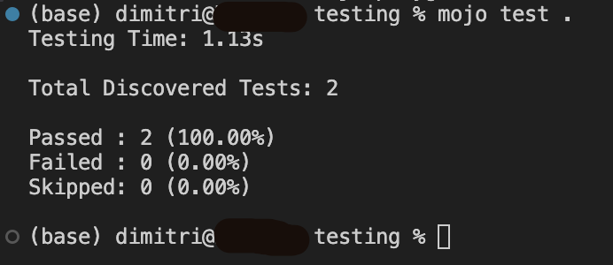
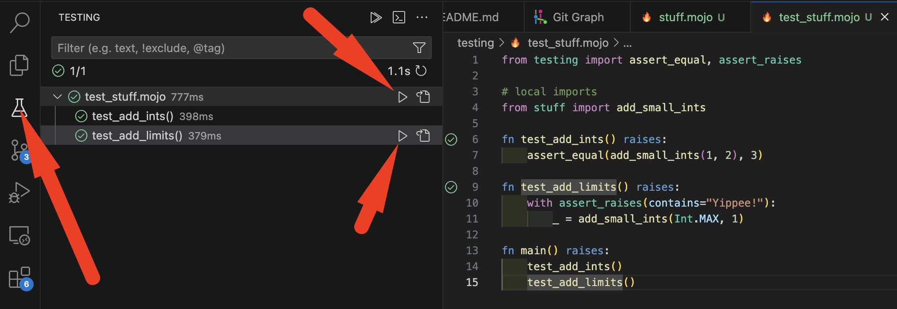

# testing

Currently, it appears Mojo supports file-based testing. I.e., create a file
named `test_<module>.mojo` and build some tests inside there.

[Mojo's testing docs](https://docs.modular.com/mojo/stdlib/testing/testing)

Then, you can run your tests from the terminal:

- cd to the directory with your tests
- run `mojo test .`

In VS-Code, you can also use the test-lab-flask-thingy -- click the lab-flask
icon (left) and you'll get a pane of tests that you can run. When you hover over
a file name, you can run all tests in that file. Or, hover over an individual
test and run it.

I'm not sure if we can just re-run failed tests or have an auto-run watcher for
when either test-code or tested-code is edited. But the little
test-lab-flask-thingy is a pretty nice view, too.

